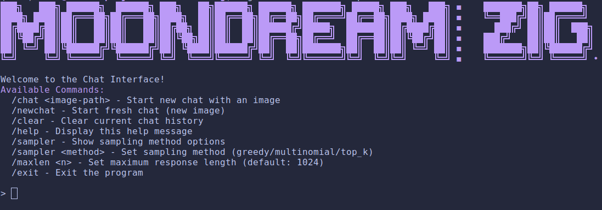

# moondream-zig

A custom implementation of the Moondream2 VLM in Zig.

[](LICENSE)

## Table of Contents

- [Overview](#overview)
- [Features](#features)
- [Installation](#installation)
- [Usage](#usage)
  - [Running Chat](#running-chat)
  - [Running API Server](#running-api-server)
  - [Configuration Options](#configuration-options)
- [Benchmarks](#benchmarks)
- [File Structure](#file-structure)
- [Contributing](#contributing)
- [Future Plans](#future-plans)
- [Acknowledgements](#acknowledgements)
- [License](#license)

## Overview

moondream-zig is a high-performance implementation of the Moondream2 vision-language model written from-scratch in Zig. This project aims to provide fast and efficient CPU-based inference for the Moondream2, and is written from a educational perspective into engineering fast inference systems. This project also enables visual understanding and question answering in resource-constrained environments without requiring a GPU, and can be cross compiled for many environments with Zig's wonderful compiler.

## Features

- Custom math operations and matrix multiplication kernels optimized for AVX2 (x86) (with decent performance on NEON (ARM))
- Original FP16 (half-precision) support for efficient memory usage
- Interactive multi-turn chat client for conversation with images
- Single-turn inference client for direct image question answering
- Minimal dependencies with native Zig implementation of all core operations
- Simple and straightforward usage with sensible defaults

## Installation and Running

### Prerequisites

- Zig 0.13.0 or later
- Python 3.10.0 or later

We require some python libraries to run a script that will convert safetensors files into a custom format.

To install these libraries, use the requirements.txt file:

```bash
pip install -r requirements.txt
```

### Downloading and Converting the Weights

To download the model.safetensors file and the tokenizer.json file and convert the weights file into a custom format, we need to run a the `weights.py` script.

```bash
python weights.py
```

### Building from Source

Here is how you can build the binaries for the full project. You can skip this step if you want to build binaries for chat mode or single turn mode specifically.

```bash
# Clone the repository
git clone https://github.com/your-username/moondream-zig.git
cd moondream-zig

# Build the project
zig build -Doptimize=ReleaseFast
```

### Running Chat

The interactive chat mode allows you to have a conversation with the model using images and text over multiple turns.

You can directly build and run chat by using the following build script:

```bash
zig build run-chat -Doptimize=ReleaseFast
```
or if you have built the binaries using the building from source step, you can access it using:

```bash
# Basic usage
./zig-out/bin/moonchat
```

#### Chat Configuration Options

The chat configuration options are displayed when you launch the chat client.

At any point of time in the chat you can type in /help to request the available commands.



### Running Single-Turn Client

The single-turn client allows you to process one image and prompt at a time.

```bash
# Basic usage
./moondream-zig --image /path/to/image.jpg "Describe this image"

# With configuration options
./moondream-zig --model /path/to/moondream.bin --tokenizer /path/to/tokenizer.bin /path/to/image.jpg "What's in this image?"

# With temperature setting
./moondream-zig --temp 0.8 /path/to/image.jpg "What's in this image?"
```

#### Single-Turn Client Configuration Options

| Option | Description | Default |
|--------|-------------|---------|
| `--model` | Path to the model weights | `../moondream.bin` |
| `--tokenizer` | Path to the tokenizer file | `../tokenizer.json` |
| `--image` | Path to the image file | `../images/frierenburger.jpg` |
| `--prompt` | Prompt for the model | `"describe the image"` |
| `--max-tokens` | Maximum tokens to generate | `200` |
| `--sampling` | Sampling method: 'greedy' or 'topk' | `greedy` |
| `--temperature` | Temperature for top-k sampling (0-2.0) | `0.5` |
| `--top-k` | Top-k sampling threshold | `3` |
| `--noheader` | Disable ASCII header display | (Not specified) |
| `--stats` | Enable timing statistics output | `disabled` |

## Benchmarks

moondream-zig is a CPU implementation optimized primarily for x86 processors with AVX2 instruction sets, while also providing decent performance on ARM processors with NEON instruction sets (Apple Silicon).

Below are performance benchmarks comparing moondream-zig with other implementations:

### Inference Speed (tokens/sec)

| Implementation | x86 with AVX2 (Intel i7-13620H) | ARM with NEON (Apple M3 Pro) |
|----------------|----------------------------------|---------------------------|
| moondream-zig  | 8                            | 14                        |
| Python (Huggingface)| 5.5                           | 10.5                      |


*Note: These benchmarks were run on consumer CPUs with the model in FP16 precision. Performance may vary based on your specific hardware. Please feel free to submit your own benchmarks in an issue!*

## File Structure

```
.
├── build.zig                # Zig build script
├── images/                  # Sample images for testing
├── model.safetensors        # Model weights in safetensors format
├── moondream.bin            # Converted model weights
├── tokenizer.bin            # Tokenizer data
├── tokenizer.json           # Tokenizer configuration
├── src/
│   ├── core/                # Core numerical operations
│   │   ├── attention.zig    # Self-attention implementation
│   │   ├── bench.zig        # Benchmarking utilities
│   │   ├── hgemm_trans.zig  # Half-precision matrix multiplication (transposed)
│   │   ├── hgemm.zig        # Half-precision matrix multiplication
│   │   ├── matmul_test.zig  # Matrix multiplication tests
│   │   ├── ops_test.zig     # Operations tests
│   │   ├── ops.zig          # Core tensor operations
│   │   ├── rope.zig         # Rotary position embeddings
│   │   ├── sgemm_inplace.zig # Single-precision matrix multiplication (inplace)
│   │   ├── sgemm.zig        # Single-precision matrix multiplication
│   │   └── tensor.zig       # Tensor data structure and operations
│   ├── dependencies/        # External dependencies
│   │   ├── stb_image.c      # Image loading library
│   │   ├── stb_image.h
│   │   ├── stb_image_resize2.c # Image resizing library
│   │   └── stb_image_resize2.h
│   ├── model/               # Model architecture
│   │   ├── config.zig       # Model configuration
│   │   ├── text_model.zig   # Text model implementation
│   │   ├── vision_model.zig # Vision model implementation
│   │   └── weights.zig      # Weights loading and handling
│   ├── preprocessing/       # Input preprocessing
│   │   ├── preslice_text.zig # Text preprocessing
│   │   ├── preslice_vision.zig # Vision preprocessing
│   │   └── tokenizer.zig    # Tokenization implementation
│   ├── profile_analysis/    # Performance profiling results
│   │   ├── analysis_report.txt
│   │   ├── cumulative_time.png
│   │   ├── operation_times_bar.png
│   │   └── operation_times_pie.png
│   ├── utils/               # Utility functions
│   │   ├── image_display.zig # Image display utilities
│   │   ├── reshape_handler.zig # Tensor reshaping utilities
│   │   └── sampling.zig     # Text sampling utilities
│   ├── moonchat.zig         # Interactive chat client
│   ├── moondream.zig        # Single-turn inference client
│   └── tensor_log.py        # Tensor logging and analysis script
├── requirements.txt         # Python dependencies
├── shell.nix                # Nix environment definition
├── tokenizer.py             # Tokenizer conversion script
└── weights.py               # Weights conversion script
```

## Contributing

Contributions are welcome! Please feel free to Fork the repository submit a Pull Request.


## Future Plans

- [ ] INT8/INT4 quantization support for reduced memory usage
- [ ] Batch processing support for higher throughput
- [ ] AVX-512 kernel optimizations

## Hire me this summer!


## Acknowledgements

This project would not have been possible without the following:

- The [Moondream](https://github.com/vikhyat/moondream) project by Vikhyat Korrapati for the original model implementation
- [Zig](https://ziglang.org/) programming language and community for creating an efficient systems programming language
- The many open-source AI projects that have made vision-language models accessible
- Shoutout to @httpslinus, @k7agar, @_vatsadev,  @seatedro, @dnbt777, @ParsaKhaz, @AdjectiveAlli, @sasuke__420, @jrysana, @qtnx_, @felix_red_panda, @kalomaze, @Aryvyo, @Guudfit and more on X for giving me ideas, testing my implementation, helping me bench my code and debugging!
- Folks at Huggingface like Alvaro Bartolome, Arthur Zucker for their support with the tokenizer and benchmarking.

This project draws inspiration from other LLM inference implementations like [llama2.c](https://github.com/karpathy/llama2.c) by Andrej Karpathy, [llama.cpp](https://github.com/ggerganov/llama.cpp) by Georgi Gerganov.

## License

This project is licensed under the Apache 2.0 - see the [LICENSE](LICENSE) file for details.

---

*Note: This README is a template. Make sure to fill in the placeholders with your specific project information before publishing.*
```bash
cd src/
zig build run -Doptimize=ReleaseFast
```
